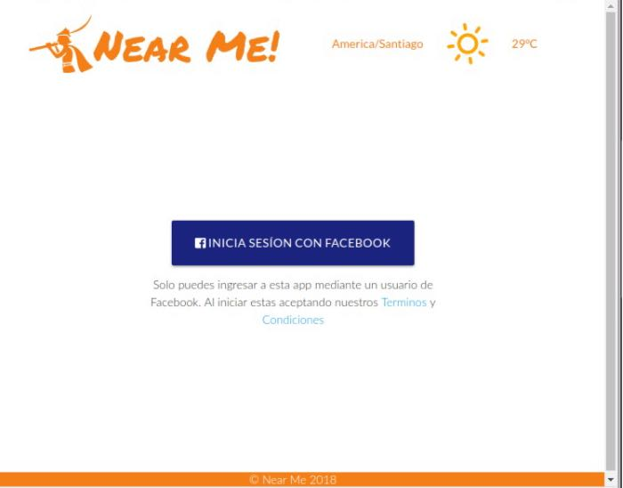
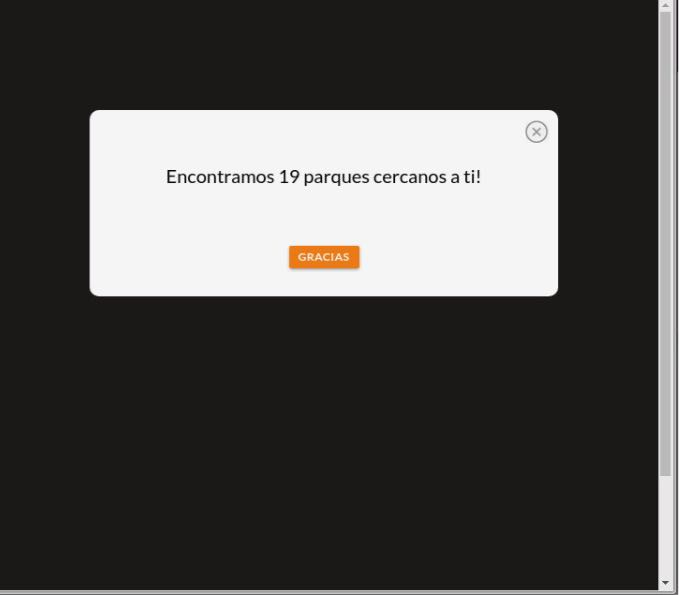
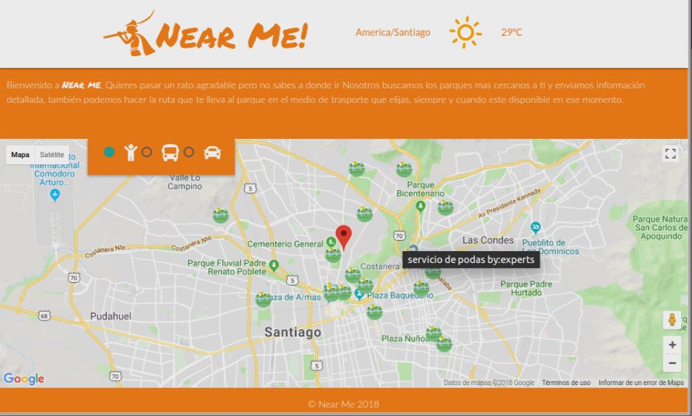

# ** NEAR ME **
- **PROYECTO EN FIREBASE** - (https://findme-visidevi.firebaseapp.com)

##  **OBJETIVO**
MoSTRAR NUESTROS CONOCIMIENTOS del manejo de APIS

##  **DESARROLLO**

-Es6 Fetch: Para llamar la api
-Google Maps API, -Google Place API

##Nuestra app se visualiza asi:

,
,

##  Lenguaje 
- javascript

##  Herramientas
-Dark sky Api
-Facebook Api
-Google Maps API 
-Google Place API
- Html5
- Jquery
- Hosting Firebase

## Autoras
- **Nadia** - [@Nadia](https://github.com/NadiaMorales)
- **Kesly** - [@Kesly](https://github.com/keslymartinez)

- **Visaka** - [@visidevi](https://github.com/visidevi)

Open source; 2018
